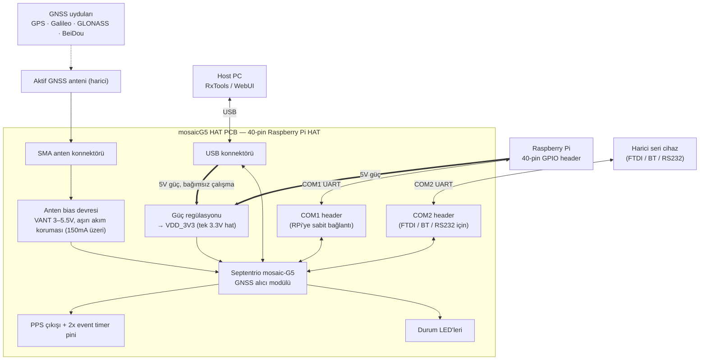

# Donanım blok diyagramı — mosaicG5 HAT referans tasarımı

Bu diyagram, referans adayı `septentrio-gnss/mosaicG5-HAT` ve öncülü `mosaicHAT` (Septentrio mosaic-X5 tabanlı, aynı kart-seviyesi mimariyi paylaşan açık kaynak Raspberry Pi HAT tasarımı) araştırılarak, Septentrio'nun mosaic donanım kılavuzundaki modül arayüz bilgileriyle birlikte oluşturulmuştur.

## Diyagram

## Blok açıklamaları

- **mosaic-G5 modülü** — Septentrio'nun çok bantlı, çok takımyıldızlı (GPS, Galileo, GLONASS, BeiDou) GNSS alıcı modülü; kartın çekirdeği. Tek bir 3.3V besleme hattından (VDD_3V3) çalışır.
- **Anten bias devresi** — Aktif GNSS antenine VANT pini üzerinden 3–5.5V besleme sağlar; kısa devre durumunda 150mA üzeri akımı algılayıp modülü korur.
- **Güç regülasyonu** — Raspberry Pi'nin 40-pin header'ından veya USB konnektöründen gelen 5V'u modülün tek besleme hattı olan VDD_3V3'e indirger.
- **COM1 / COM2** — Modülün seri portları. COM1 sabit olarak Raspberry Pi GPIO header'ındaki UART hattına bağlıdır; COM2 ayrı bir header üzerinden dışa açılır ve FTDI, Bluetooth veya RS232 dönüştürücü bağlamak için kullanılabilir.
- **USB konnektörü** — Modülün USB arayüzünü dışa açar; hem veri/yapılandırma (RxTools, WebUI) hem de bağımsız çalışma modunda güç sağlayabilir.
- **PPS + event timer** — Saniye-başı darbe (PPS) çıkışı ve 2 adet olay zamanlayıcı girişi; zamanlama/senkronizasyon uygulamaları için.
- **Durum LED'leri** — Modülün ve kartın çalışma durumunu gösteren gösterge LED'leri.
- **Mekanik** — HAT standardına uygun 4 montaj deliği (diyagrama dahil edilmedi, sinyal/güç akışına dahil olmayan mekanik bir unsur).

## Kapsam notu

Bu diyagram referans adayının (`mosaicG5-HAT`) kart-seviyesi mimarisini belgeler; müşterinin gerçek hedef kartının doğrulanmış şeması değildir. Hedef için girdi hâlâ `TARGET-INPUT-BLOCKED` durumunda olduğundan, bu diyagram şu an yalnızca DRC/metodoloji taban çizgisi ve genel mimari referansı amacıyla kullanılmaktadır. Gerçek hedef kart için exact parça ve stack-up bilgisi olmadan buradaki sayısal değerler (VANT aralığı, akım eşiği vb.) doğrudan kopyalanmamalıdır.

## Kaynaklar

- Septentrio mosaic Hardware Manual — mosaic modül ailesinin ortak dahili mimarisi ve arayüzleri
- github.com/septentrio-gnss/mosaicG5-HAT — referans aday deposu
- github.com/septentrio-gnss/mosaicHAT — mosaic-X5 tabanlı öncül tasarım, aynı kart-seviyesi mimariyi paylaşır
- septentrio.com mosaic-G5 ürün sayfaları
